# Pilot

**Your AI dev team.** Pilot lets you direct a crew of AI coding agents — they work on separate git branches in parallel, you review and merge their output. Self-hosted, server-first.

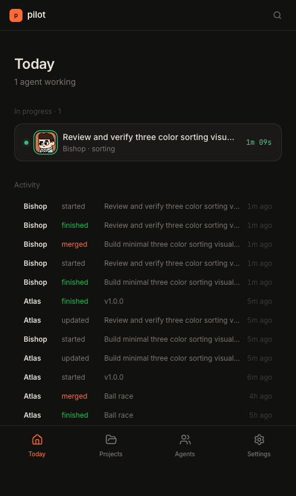

---

## How it works

1. **Add a project** — clone from GitHub, point to a local repo, or start empty
2. **Hire agents** — named personas (Atlas, Bishop, Cleo…) backed by your API keys or Claude subscription
3. **Create tasks** — title + prompt, optionally attach files; tasks queue up per project
4. **Dispatch** — assign tasks to idle agents; each gets a git worktree and starts running
5. **Review** — watch live output, inspect the diff, optionally request a peer review from another agent
6. **Merge** — one click merges the branch to main; push to GitHub if you have a remote

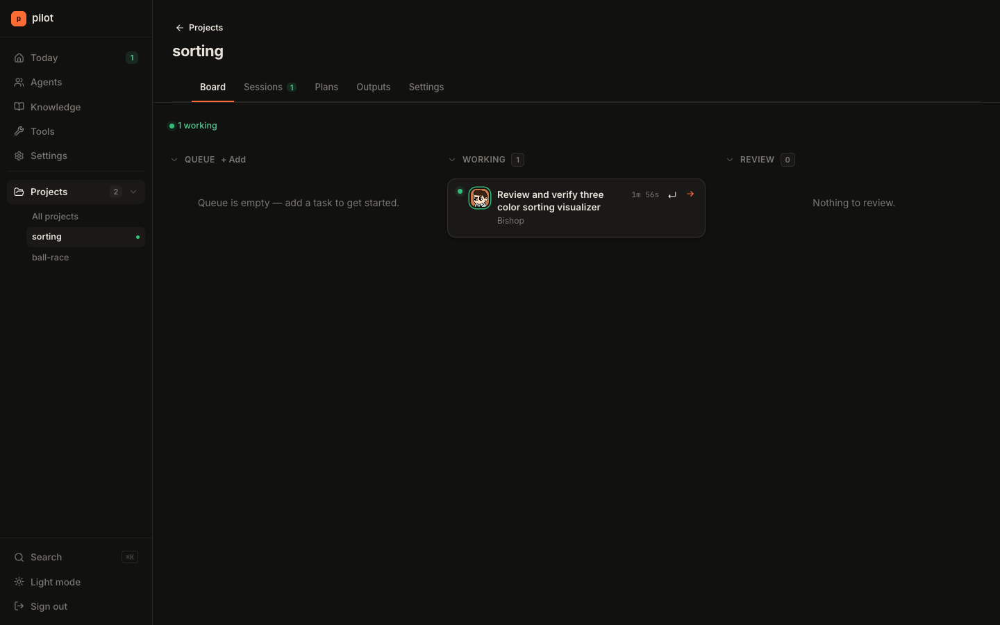

---

## Architecture

```
server/   Node.js + Express + SQLite (better-sqlite3) + WebSocket
web/      React 19 + Vite + Tailwind v4 + TanStack Query
app/      Swift/SwiftUI iOS + macOS client (in development)
```

The server is the source of truth. The web UI and iOS/Mac client are both clients to the same REST + WebSocket API. Agents run as spawned subprocesses (`claude` or `codex` CLI) inside git worktrees — fully isolated, fully auditable.

---

## Screenshots

| | |
|---|---|
|  | 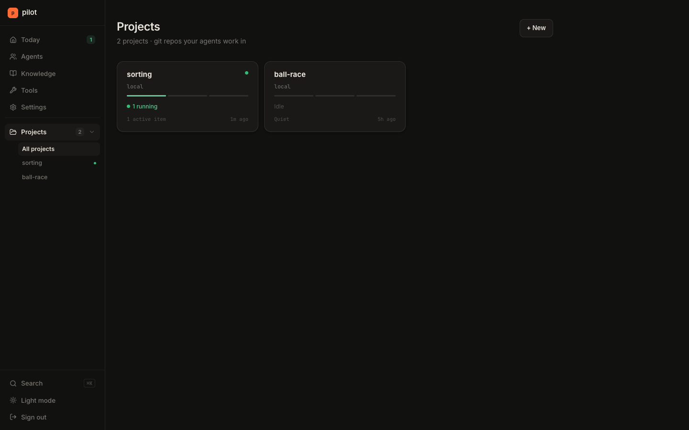 |
|  | 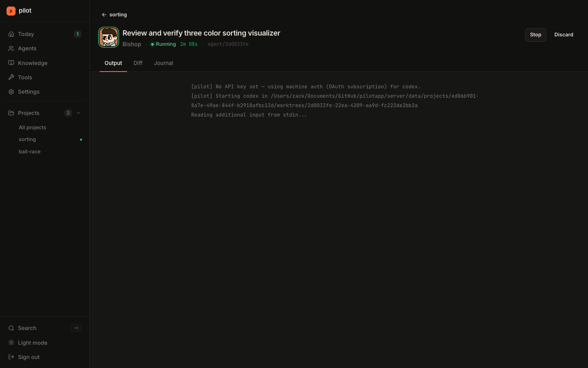 |
| 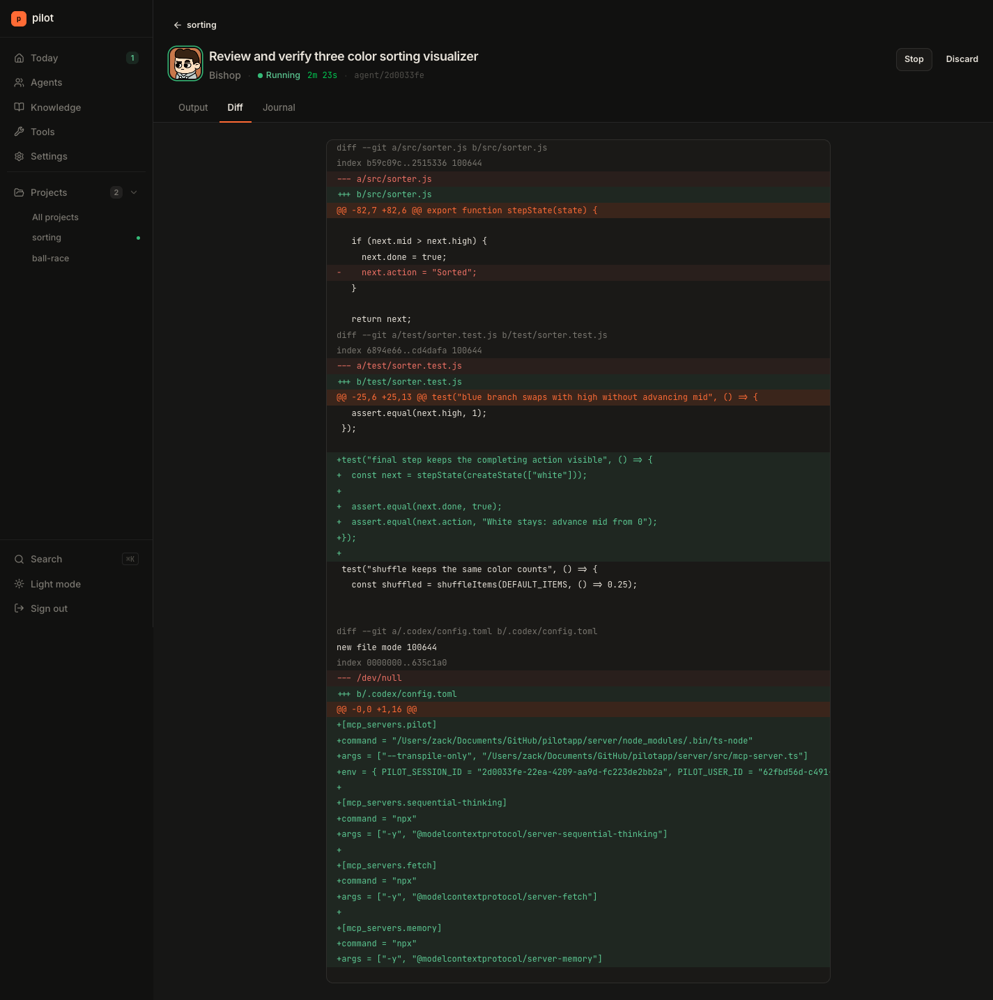 | 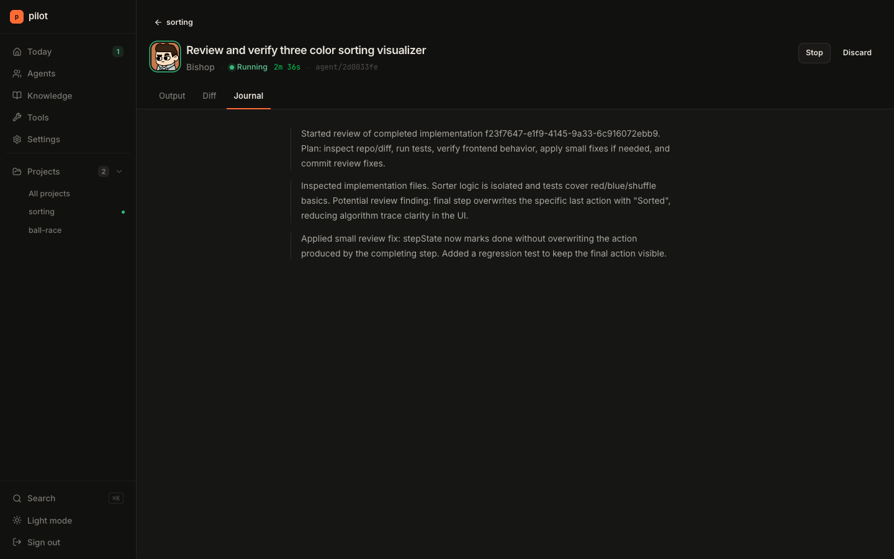 |
| 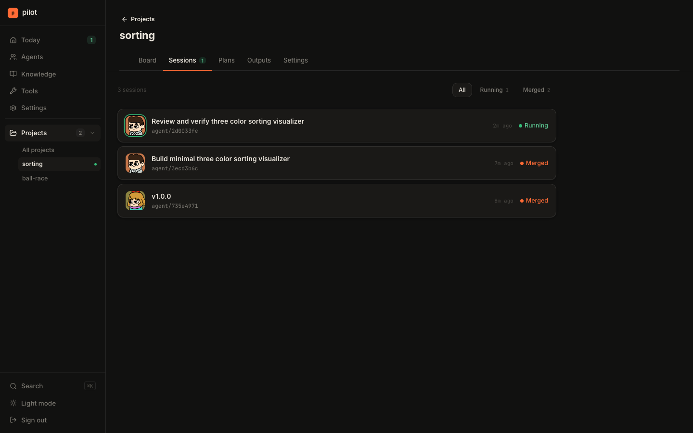 | 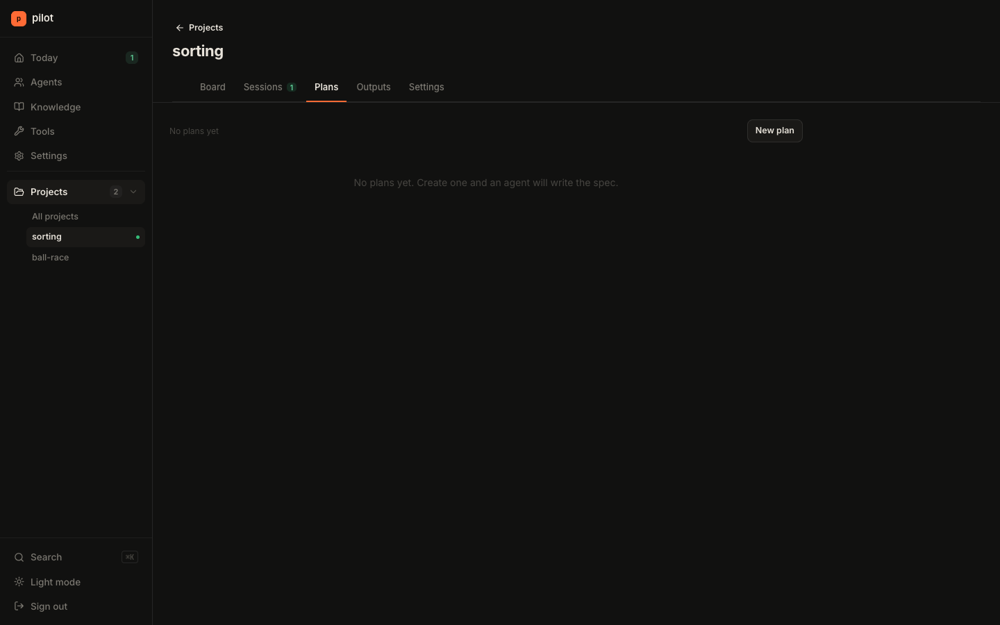 |
| 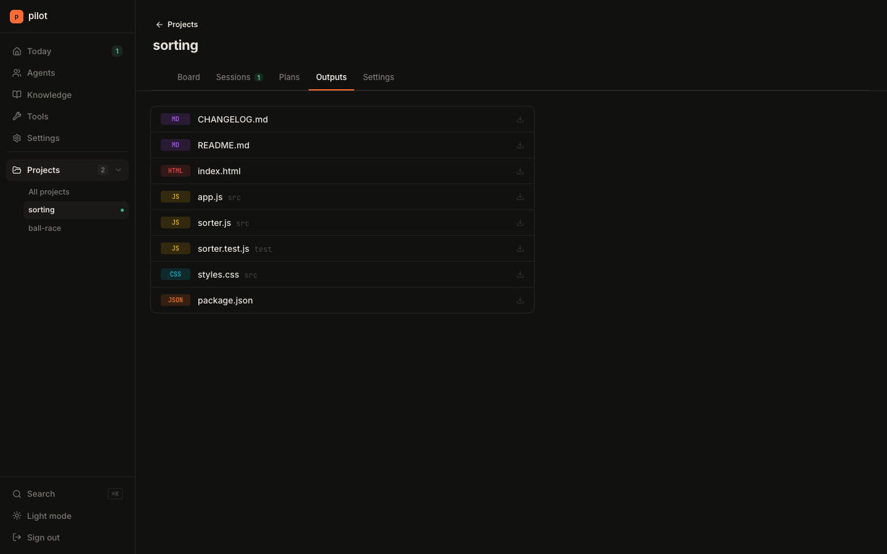 | 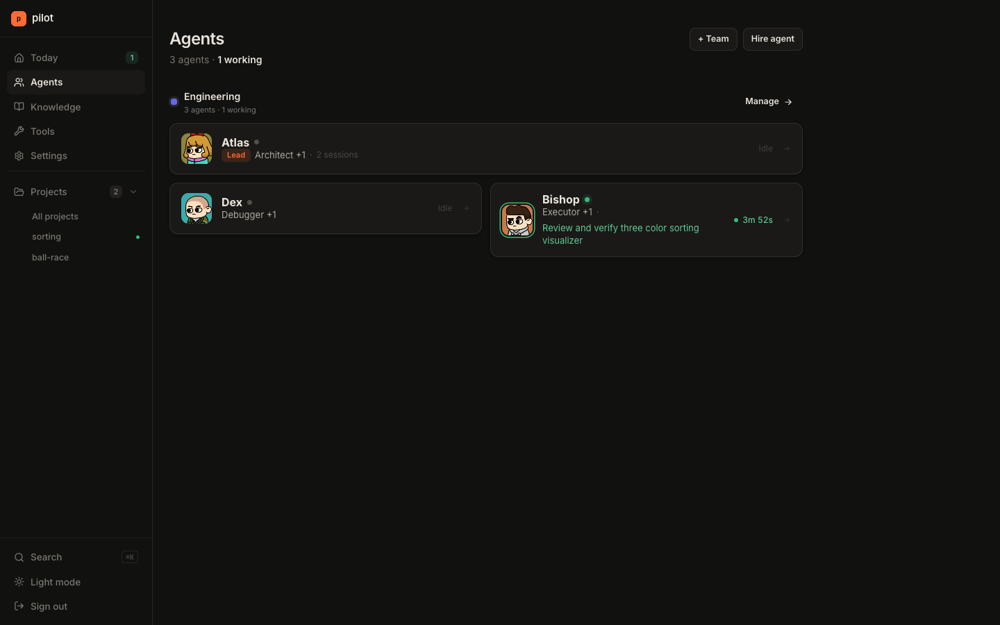 |
| 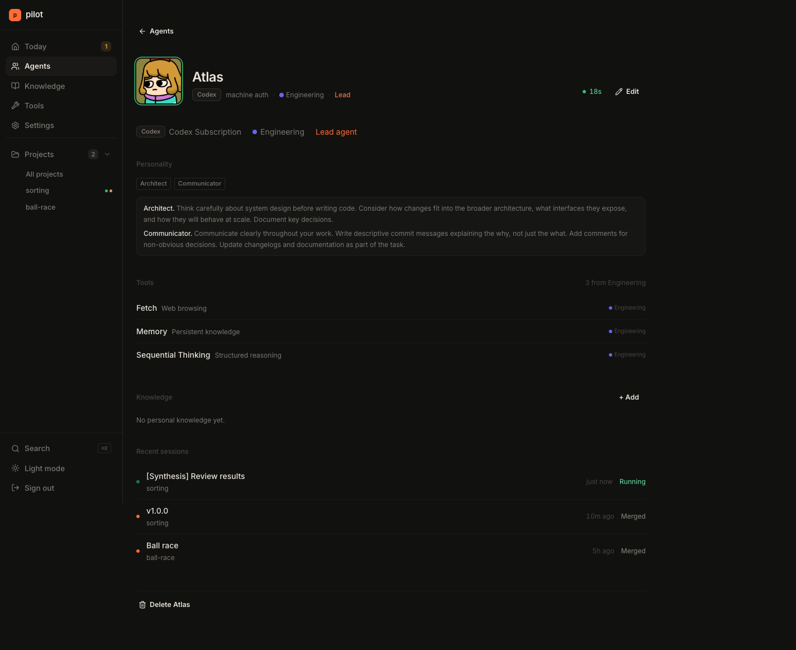 | 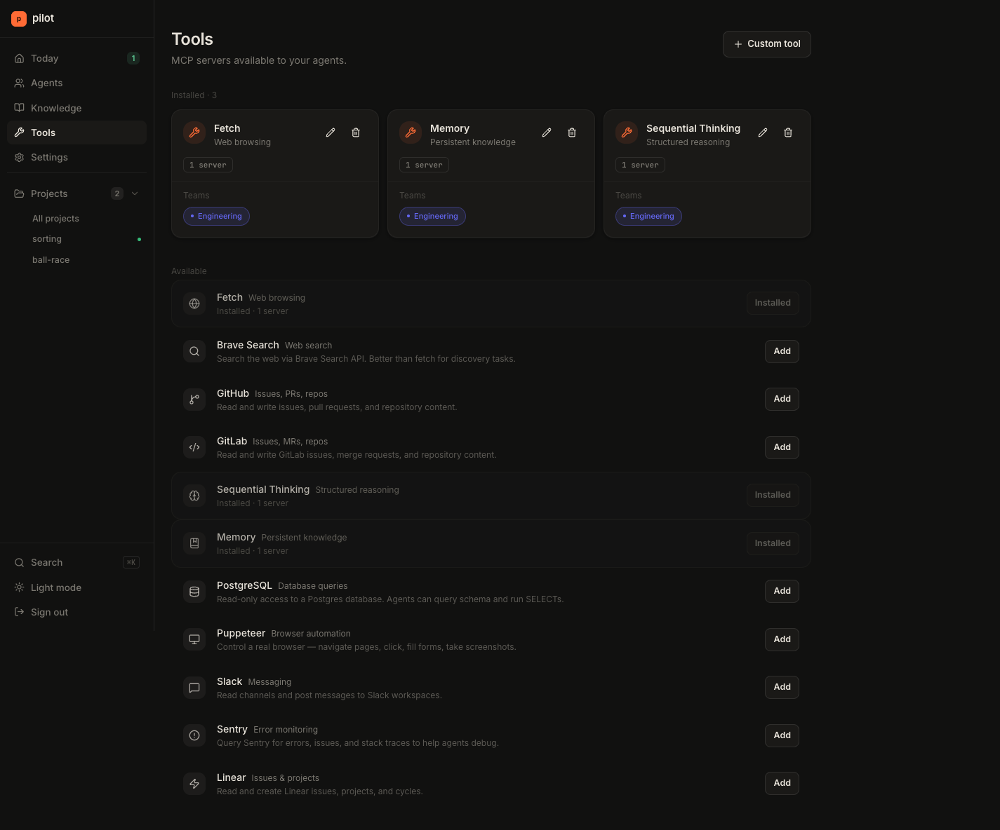 |
| 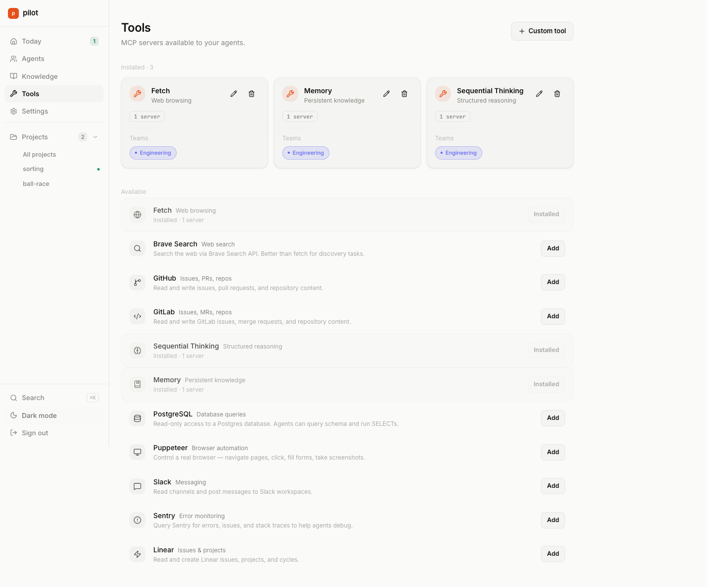 | 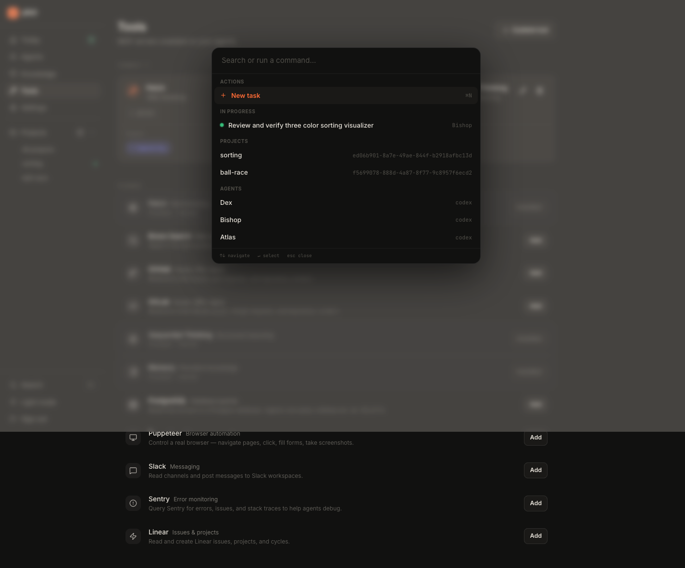 |

---

## Features

- **Kanban board** — Queue / Working / Review columns per project; live status via WebSocket
- **Agent personalities** — per-agent prompt prefix, preset or custom; shapes how they approach work
- **Teams** — group agents into departments; one lead agent can orchestrate workers
- **Peer review** — request a second agent to review a diff; structured approve / changes-requested output
- **Knowledge base** — attach docs to agents or projects; injected as context at run time
- **MCP tools** — assign MCP server tools per agent or per team; injected via `--mcp-config`
- **Plans/Specs** — AI-generated planning docs that can be turned into tasks
- **Multi-turn sessions** — continue a finished session; agent resumes with full context
- **Clarifications** — agent can ask you questions mid-run; you respond in the UI
- **Workspace mode** — non-git projects where agents write to a shared folder (good for research, writing, scripts)
- **File attachments** — attach files to tasks; copied into the agent's worktree at start
- **Activity feed** — human-readable log of what every agent did
- **Light + dark mode**
- **Self-hostable** — single Docker image, SQLite, no external services required

---

## Quick start

### Prerequisites

- Node.js 20+
- `claude` CLI ([install](https://docs.anthropic.com/en/docs/claude-code)) and/or `codex` CLI
- Git

### Dev

```bash
git clone https://github.com/yourname/pilotapp
cd pilotapp
npm install          # installs concurrently at root
npm run dev          # starts server (:3000) and web (:5173) together
```

Open [http://localhost:5173](http://localhost:5173) and register your first account.

### Production (Docker)

```bash
docker compose up -d
```

Server runs on port 3000. Set `JWT_SECRET` and `DATA_DIR` in `docker-compose.yml` before deploying.

---

## Environment variables

| Variable | Default | Notes |
|---|---|---|
| `PORT` | `3000` | Server port |
| `DATA_DIR` | `./data` | SQLite db, session logs, cloned repos |
| `JWT_SECRET` | `change-me-in-production` | **Set this.** Warns loudly if unset outside dev |
| `ANTHROPIC_API_KEY` | — | Fallback key for all Claude sessions |
| `OPENAI_API_KEY` | — | Fallback key for all Codex sessions |
| `ALLOW_REGISTRATION` | — | Set to `true` to allow more than the first user |
| `NODE_ENV` | — | Set to `development` to suppress the JWT warning |

First boot: registration is open for the first account only. Subsequent signups are blocked unless `ALLOW_REGISTRATION=true`.

---

## Self-hosting

### Docker Compose

```yaml
# docker-compose.yml (already in the repo)
services:
  pilot:
    image: pilotapp
    build: .
    ports:
      - "3000:3000"
    environment:
      JWT_SECRET: your-secret-here
      DATA_DIR: /data
    volumes:
      - pilot-data:/data
volumes:
  pilot-data:
```

```bash
docker compose up --build -d
```

The image builds the web UI and serves it from the Express server on the same port.

### Reverse proxy (nginx / Caddy)

Point your proxy to `localhost:3000`. WebSocket upgrades must be forwarded — ensure `Upgrade` and `Connection` headers pass through.

**Caddy example:**
```
pilot.example.com {
    reverse_proxy localhost:3000
}
```

---

## iOS / macOS app

The `app/` directory contains a Swift/SwiftUI client targeting iOS 17+ and macOS 14+. It is in early development — the current build is a placeholder that will grow into:

- Push notifications (APNs) for session events (done, error, needs review)
- Live Activities — Dynamic Island + lock screen for active sessions
- Home screen widgets for office status at a glance
- QR code pairing to connect to your self-hosted server
- Menu bar app (macOS) with quick merge / discard actions

To build: open `app/Pilot.xcodeproj` in Xcode 16+ and run on a simulator or device.

---

## Data model

| Entity | Description |
|---|---|
| **Projects** | A git repo (bare clone) on disk, with optional GitHub remote |
| **Connections** | API credentials — Anthropic key, OpenAI key, or subscription auth |
| **Agents** | Named personas: connection + model + personality + tools |
| **Departments** | Teams of agents; one lead, N workers |
| **Tasks** | Title + prompt + priority queue; attached files optional |
| **Sessions** | One agent × one worktree × one branch; streams output via WebSocket |
| **Specs** | AI-written planning docs (SPEC.md); can be promoted to tasks |
| **Knowledge** | Docs scoped to an agent or project; injected as context |
| **Tools** | MCP server configs assignable per agent or per department |

---

## Dev setup details

```
server/   npm run dev     — ts-node-dev, restarts on change
web/      npm run dev     — Vite HMR, proxies /api and /ws to :3000
```

The root `npm run dev` uses `concurrently` to start both. Run them separately if you want independent logs.

---

## License

MIT
